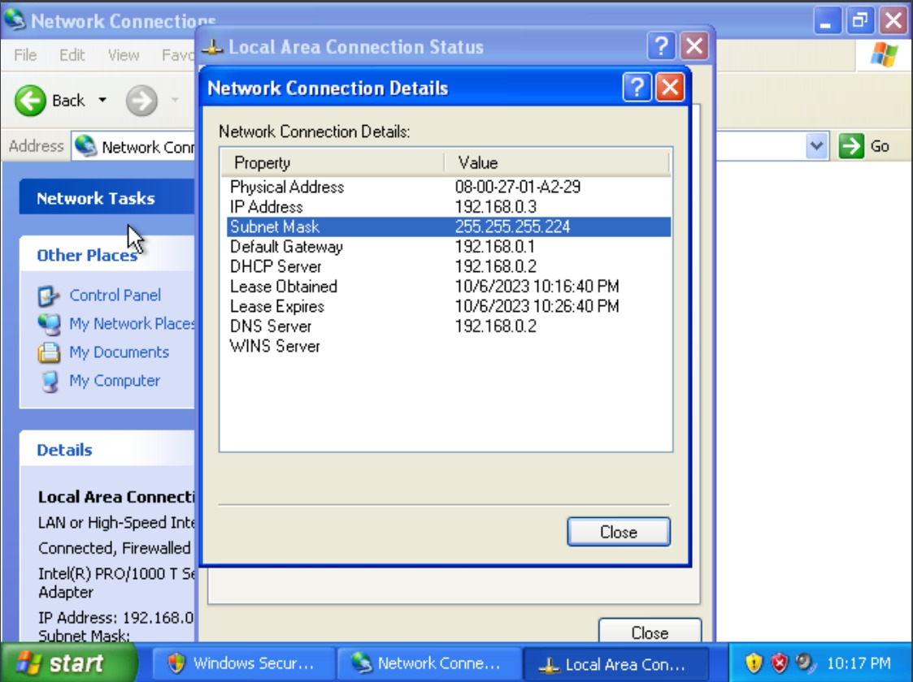

---
hide:
  - toc
---

# Chapther 1 : Creating a DHCP Server wih Debian

### Creating A  dhcp server

Pertama tama kita membutuhkan 2 OS satu untuk `Server` dan satu untuk `Client`
saya menggunakan  
Debian7 `Sebagai Server`  
WinXP `Sebagai Client`

Setelah kita berhasil menginstall keduanya kita perlu mengkonfigurasi `Server` kita
Masuklah ke root dari OS `Debian` kalian memasukan `root` pada kolom login dan masukan password yang telah kalian buat

### 1. Install Server DHCP kalian
Buka Terminal dan jalankan perintah untuk menginstall ISC DHCP Server:

```
sudo apt update
sudo apt install isc-dhcp-server
```
### 2. Konfigurasi ISC DHCP Server
Setelah instalasi selesai, Anda perlu mengkonfigurasi server DHCP. File konfigurasi utama berada di /etc/dhcp/dhcpd.conf. Anda dapat mengedit file ini dengan menggunakan editor teks seperti nano atau vim.

```
sudo nano /etc/dhcp/dhcpd.conf
```
Di dalam file konfigurasi, Anda harus menentukan subnet dan konfigurasi IP yang akan diberikan oleh server DHCP. Contoh konfigurasi sederhana:

```
subnet 192.168.1.0 netmask 255.255.255.0 {
    range 192.168.1.100 192.168.1.200;
    option routers 192.168.1.1;
    option domain-name-servers 8.8.8.8, 8.8.4.4;
}
```
### 3. Konfigurasi ethernet default 
Anda perlu menentukan ethernet default yang akan digunakan oleh server DHCP. Edit file konfigurasi antarmuka di /etc/default/isc-dhcp-server:
```
sudo nano /etc/default/isc-dhcp-server
```

### 4. Restart DHCP Server
Setelah mengonfigurasi server DHCP, restart layanan dengan perintah:
```
sudo service isc-dhcp-server restart
```

### 5. Aktfikan penerusan jika diperlukan
ika server DHCP berada di antara jaringan berbeda, pastikan Anda telah mengaktifkan penerusan paket di server Debian. Anda dapat mengaktifkannya dengan menjalankan perintah berikut:
```
sudo sysctl -w net.ipv4.ip_forward=1
```

Untuk membuat perubahan ini tetap setelah reboot, tambahkan baris berikut ke /etc/sysctl.conf:
```
net.ipv4.ip_forward=1
```
Terakhir, Anda dapat menguji server DHCP dengan menghubungkan perangkat ke jaringan dan memeriksa apakah mereka menerima alamat IP dari server DHCP.



Ini adalah langkah-langkah dasar untuk mengatur server DHCP di Debian. Pastikan untuk menyesuaikan konfigurasi sesuai dengan kebutuhan dan kebijakan jaringan Anda.
