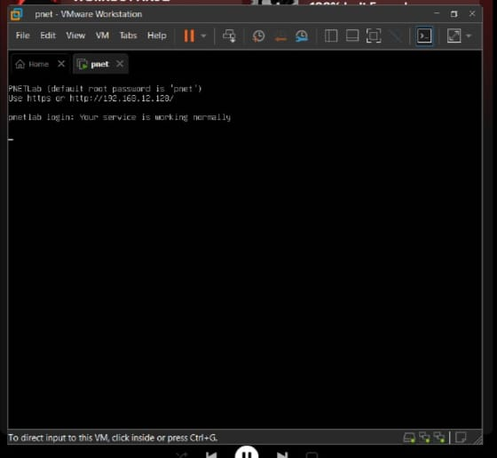
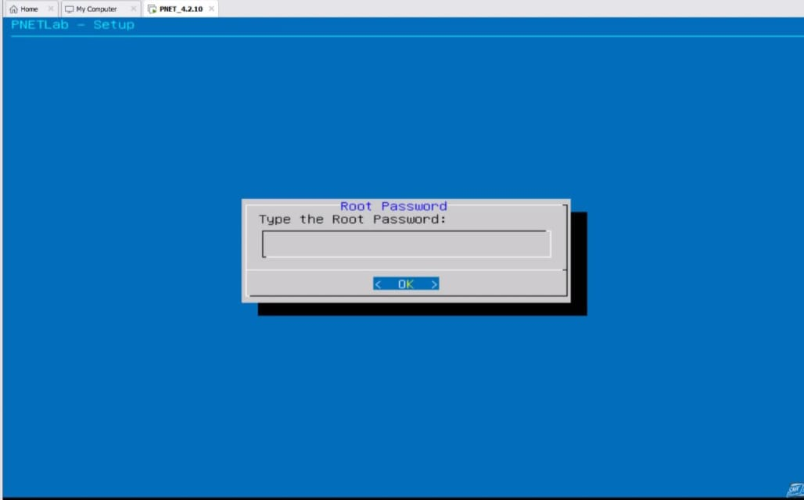
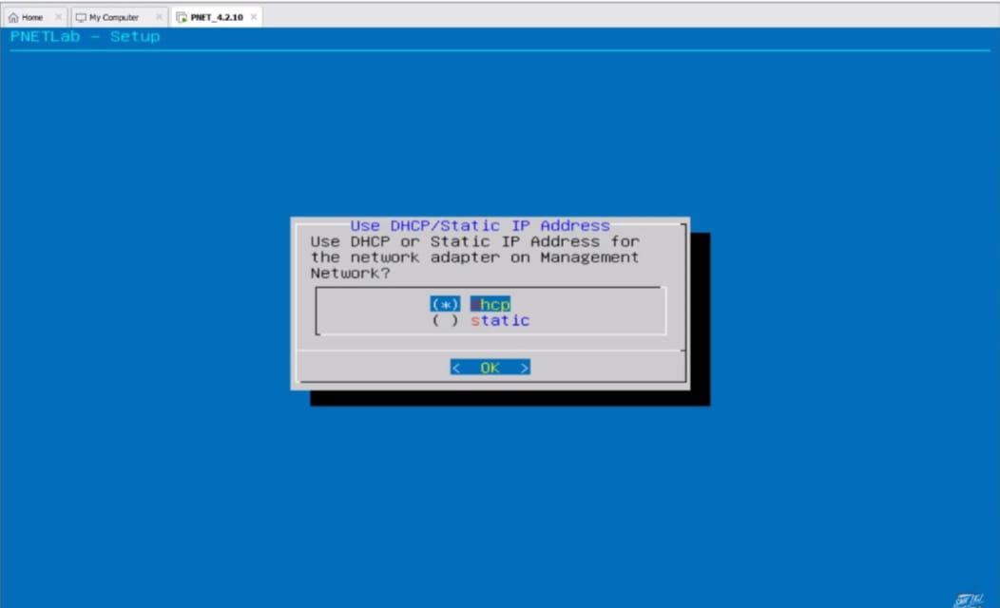
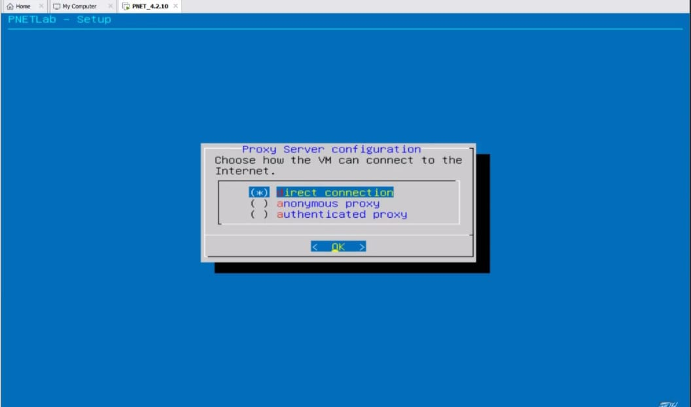
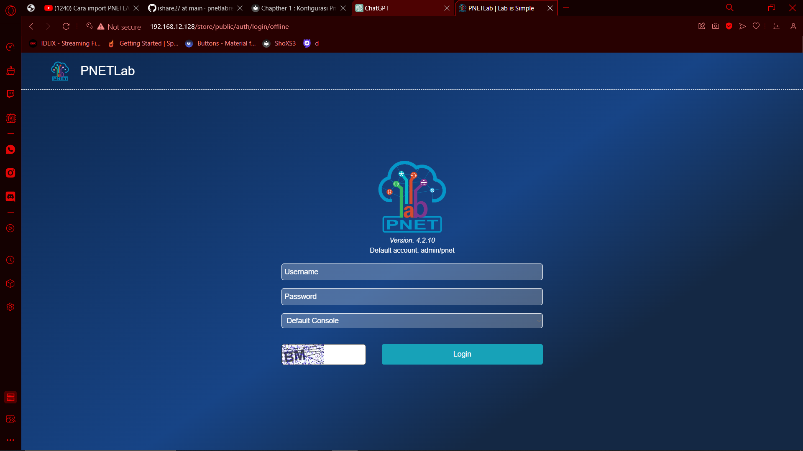
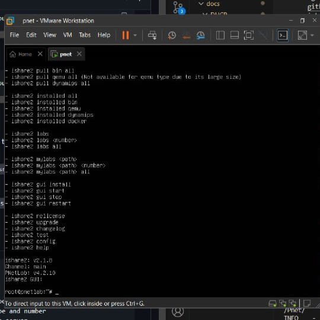

# Chapther 1 : Konfigurasi Pnet Lab

### 1. Konfigurasi Pnet
Pertama tama kita memerlukan file .OVA `Pnet Lab` kita bisa mendapatkannya dari web resmi Pnetlab yaitu https://www.pnetlab.com/pages/main

Setting `disk` dan jumlah `Processor` yag akan digunakan dan atur `Network` nya agar menjadi `NAT`

Jalankan `Pnet` jika tampilan sudah seperti ini



masukan `root` pada kolom login dan `pnet` untuk password nya setelah itu kalian akan diminta untuk membuat password root baru seperti pada gambar dibawah



kemudian kita akan diminta untuk membuat nama Kalian bebas menamai domain kalian apa saja
Selanjutnya Memilih tipe IP kita antara `DHCP` atau `Static`   



terakhir kita akan memilih bagaimana VM bisa terhubung ke internet kita pilihannyaa antara  
`Direct connetion`/`Anonymous proxy`/`authenticated proxy`  


PnetLab anda sudah selesai di konfigurasi selanjutnya kita akan konfigurasi interface nya

### 2. Konfigurasi interface
pada awal login `Pnet` kita diberikan sebuah IP address masukan IP tersebut ke browser anda maka akan muncul tampilan untuk memilih antara mode `offline` atau `online`  
(kita akan menggunakan mode offline)

selanjutnya akan muncul laman login masukan `admin sebagai user` dan `pnet sebagai password`
setelah kalian berhasil login kalian sudah bisa menggunakan pnetlab sesuka hati kalian  


### 3. Konfigurasi ishare2
Untuk mengkonfigurasi Ishare2 pertama tama kalian masuk ke root dari pnetlab kalian lalu jalankan perintah:
```
wget -O /usr/sbin/ishare2 https://raw.githubusercontent.com/pnetlabrepo/ishare2/main/ishare2 > /dev/null 2>&1 && chmod +x /usr/sbin/ishare2 && ishare2
```
atau
```
curl -o /usr/sbin/ishare2 https://raw.githubusercontent.com/pnetlabrepo/ishare2/main/ishare2 > /dev/null 2>&1 && chmod +x /usr/sbin/ishare2 && ishare2\
```
lalu jalankan perintah
```
ishare2
```
jika muncul list seperti pada gambar dibawah maka instalasi mu sudah berhasil  


### 4. Fix Permission
Masukan IP yang tadi kita dapatkan diawal ntuk mengaakses `pnet lab` jika sudah berada di home pilih system di bar atas

kemudian pilihlah `System Setting`
setelah itu pilih opsi `Fix Permission` di paling atas 

jika muncul popup seperti pada gambar dibawah maka anda sudah berhasil yeyy

### 5. Tambahkan router OS
